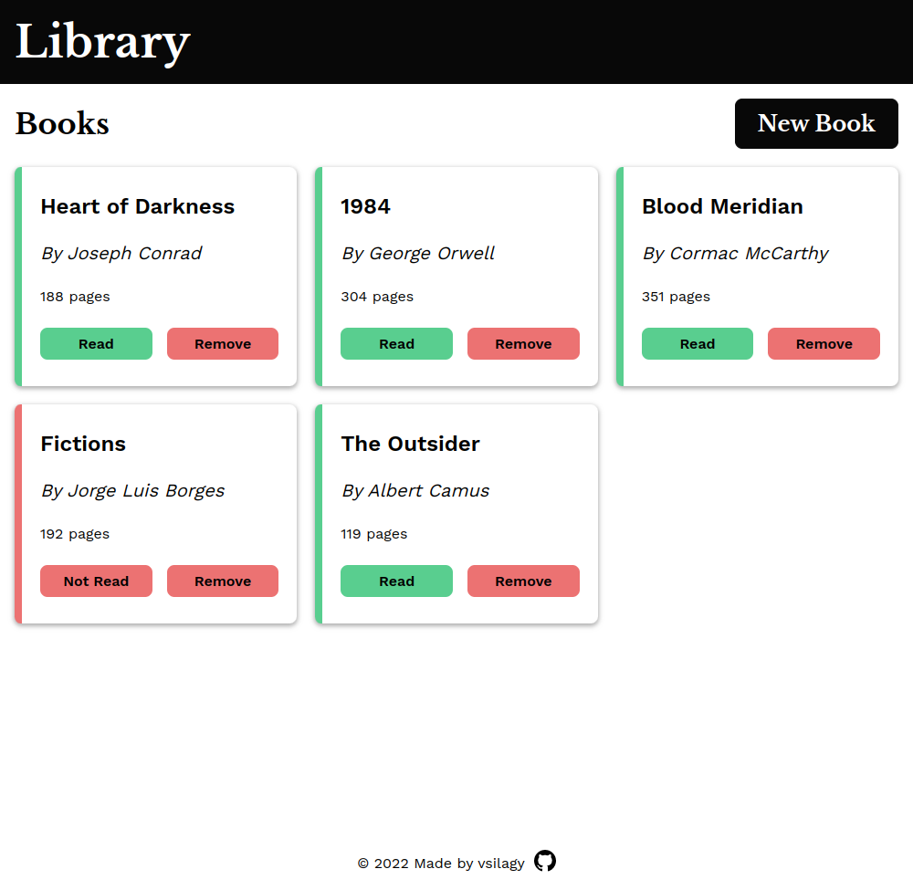

# Library

[Live Preview](https://vsilagy.github.io/library/)

### **The Odin Project** : [Library Project](https://www.theodinproject.com/lessons/node-path-javascript-library)

## Built with

### Technologies

 
    
     
     

## Objectives:

- build a library
- store books in an array
- book details input have author, title, page number and read status
- display the array of books
- add a remove book button
- add change reading status button
